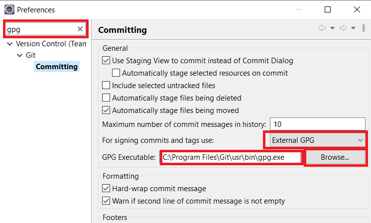

# Ejemplo de commits firmados

## Firmar los commits con gpg

Los pasos para configurar la firma de commits en git con gpg están descritos en el siguiente tutorial: 
[¿Cómo y por qué firmar tus commits?](https://binary-coffee.dev/post/como-y-por-que-firmar-tus-commits)

La única *actualización* en ese tutorial es que al añadir la clave gpg pública en tu cuenta de github, hay que añadir _"New GPG Key"_ en lugar de "New SSH Key".

## Desde Eclipse

Si has configurado la firma global según el tutorial anterior, en Eclipse los commits se firmarán también siempre de forma predeterminada. Para comprobarlo, verás que en la vista _Git Staging_ el icono del "candado" de firma GPG aparecerá marcado.

Pero si en Eclipse te da error, es porque la configuración predeterminada falla, así que hay que cambiar la configuración de GPG Executable en las Preferencias de Eclipse:

Tras ello verifica a hacer un commit firmado en Eclipse, haz push a GitHub y comprueba que el commit aparece con la etiqueta _"Verified"_.